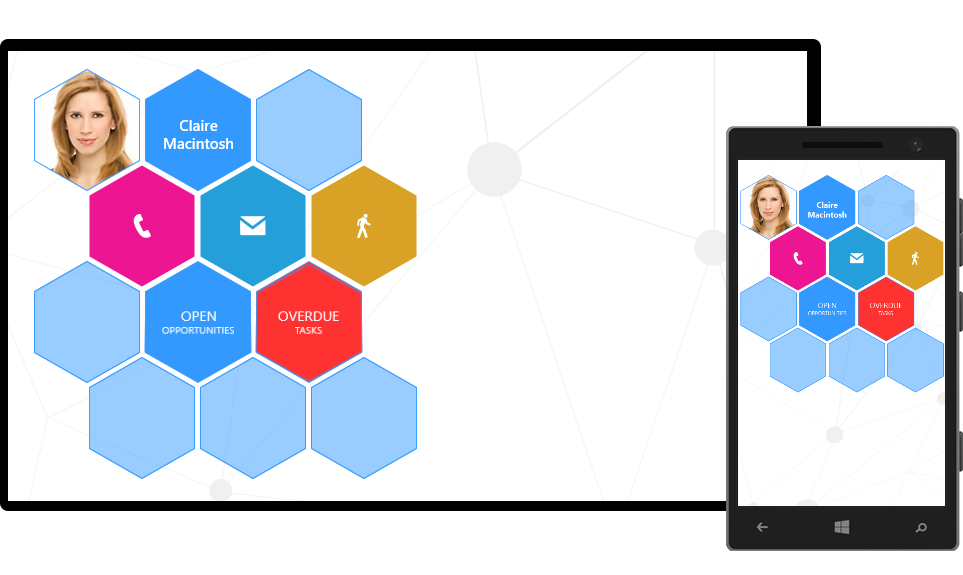

# Honeycomb Layout Using Hub Tiles

In this post I will show you how to arrange the HubTile for Universal Windows apps in a honeycomb pattern and achieve a result similar to the one below:


A task like this involves two steps.

1. Change the shape of the hub tile from square to hexagon.
2. Create a panel that will arrange the hexagons in a honeycomb layout.

## Hexagonal Hub Tiles

The default shape of RadHubTile is a square.

```
<telerikPrimitives:RadHubTile ImageSource="Assets/Image/contacts-4.jpg" />
```


 
To make it a hexagon, we need to edit the default ControlTemplate of RadHubTile. If you examine the stripped down version of the ControlTemplate below, you'll notice that all the magic happens in the Path object. The Data attribute of the Path object gives the hub tile a hexagonal shape and the Fill attribute, in conjunction with a converter, takes care of rendering the content of the hub tile.

```
<Style TargetType="telerikPrimitives:RadHubTile">
	<Setter Property="Template">
		<Setter.Value>
			<ControlTemplate TargetType="telerikPrimitives:RadHubTile">
				<Grid x:Name="PART_LayoutRoot">
					<telerikPrimitivesHubTile:FlipControl>
						<telerikPrimitivesHubTile:FlipControl.FrontContent>
							<Grid>
								<ContentPresenter Content="{TemplateBinding Message}" ContentTemplate="{TemplateBinding MessageTemplate}" />
								<Path Data="M8.055,27 L55,0 L102,27 L102,82 L55,109 L8,82 z" 
									DataContext="{TemplateBinding ImageSource}" 
									Fill="{Binding Converter={StaticResource imageBrushConverter}}" />
								<ContentPresenter Content="{TemplateBinding Title}" ContentTemplate="{TemplateBinding TitleTemplate}" />
								<ContentControl Content="{TemplateBinding Notification}" ContentTemplate="{TemplateBinding NotificationTemplate}" />
							</Grid>
						</telerikPrimitivesHubTile:FlipControl.FrontContent>
					</telerikPrimitivesHubTile:FlipControl>
				</Grid>
			</ControlTemplate>
		</Setter.Value>
	</Setter>
</Style>
```

```
public class ImageBrushConverter : IValueConverter
{
	public object Convert(object value, Type targetType, object parameter, string language)
	{
	    return new ImageBrush { ImageSource = (BitmapImage)value, Stretch = Stretch.UniformToFill };
	}
	public object ConvertBack(object value, Type targetType, object parameter, string language)
	{
	    throw new NotImplementedException();
	}
}
```


If you want to digg deeper into the custom ControlTemplate of RadHubTile, examine the Resources.xaml file in the  HoneyComb_HubTile.Shared project.

## Honeycomb Layout Panel

Creating a panel that arranges the hexagon tiles in a honeycomb pattern turned out to be easier than I thought. 
The panel has 3 properties. 

ItemLength

This dependency property is used in the MeasureOverride method and sets the width and height of each hub tile.

```
private static readonly double COS_30_DEGREE = 0.866;
protected override Size MeasureOverride(Size availableSize)
{
	foreach (UIElement child in Children)
	{
		var tile = child as FrameworkElement;
		tile.Height = this.ItemLenght;
		tile.Width = (COS_30_DEGREE * this.ItemLenght / 2) * 2;
		tile.Measure(availableSize);
	}
	return base.MeasureOverride(availableSize);
}
```  

Row and Column 
These two are attached properties and work the same way as Grid.Row and Grid.Column do. They are used in the Arrange pass of the panel.

```
protected override Size ArrangeOverride(Size finalSize)
{
	int row, column;
	double x, y, height, width;
	for (int i = 0; i < this.Children.Count; i++)
	{
		height = this.Children[i].DesiredSize.Height;
		width = COS_30_DEGREE * height;
		row = HoneycombPanel.GetRow(this.Children[i]);
		column = HoneycombPanel.GetColumn(this.Children[i]);
		x = row % 2 == 0 ? column * width : (0.5 * width + column * width);
		y = 0.75 * row * height;
		this.Children[i].Arrange(new Rect(new Point(x, y), this.Children[i].DesiredSize));
	}
	return base.ArrangeOverride(finalSize);
}
```

## Using the Honeycomb Panel

The HoneycombPanel accepts a set of hub tiles. These tiles can be arranged by using the attached HoneycombPanel.Row and HoneycombPanel.Column properties.

```
<panel:HoneycombPanel ItemLenght="122">
	<telerikPrimitives:RadHubTile panel:HoneycombPanel.Row="0" panel:HoneycombPanel.Column="0" ImageSource="Assets/Image/contacts-4.jpg" />
	<telerikPrimitives:RadHubTile panel:HoneycombPanel.Row="0" panel:HoneycombPanel.Column="1" Background="#3399ff">
		<telerikPrimitives:RadHubTile.Title>
			<TextBlock Text="Claire Macintosh" FontSize="15" FontWeight="SemiBold" TextWrapping="Wrap" TextAlignment="Center" />
		</telerikPrimitives:RadHubTile.Title>
	</telerikPrimitives:RadHubTile>
	<telerikPrimitives:RadHubTile panel:HoneycombPanel.Row="2" panel:HoneycombPanel.Column="0" />
	<telerikPrimitives:RadCustomHubTile panel:HoneycombPanel.Row="2" panel:HoneycombPanel.Column="2" Background="#FF3232">
		<telerikPrimitives:RadCustomHubTile.FrontContent>
			<StackPanel Margin="0" VerticalAlignment="Center" HorizontalAlignment="Center">
				<TextBlock Text="5" FontSize="72" FontWeight="SemiLight" HorizontalAlignment="Center" />
			</StackPanel>
		</telerikPrimitives:RadCustomHubTile.FrontContent>
		<telerikPrimitives:RadCustomHubTile.BackContent>
			<StackPanel Margin="0" VerticalAlignment="Center" HorizontalAlignment="Center">
				<TextBlock Text="OVERDUE" FontSize="14" HorizontalAlignment="Center" />
				<TextBlock Text="TASKS" FontSize="10" HorizontalAlignment="Center" />
			</StackPanel>
		</telerikPrimitives:RadCustomHubTile.BackContent>
	</telerikPrimitives:RadCustomHubTile>
</panel:HoneycombPanel>
```



To run the project you'd have to reference Telerik.Core.dll and Telerik.UI.Xaml.Primitives.dll which are part of [UI for Windows Universal](http://www.telerik.com/windows-universal-ui "UI for Windows Universal").

[](http://www.telerik.com/download/windows-universal-ui)